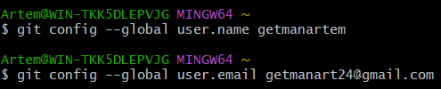
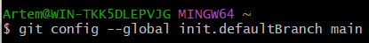
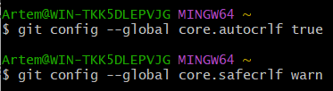
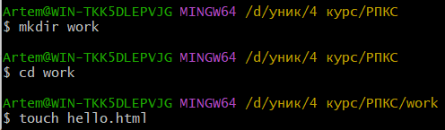
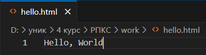

# Лабораторна робота 1: Вивчення git

Налаштування глобальних параметрів Git для коректної обробки закінчень рядків. Команда git config --global core.autocrlf true забезпечує автоматичну конвертацію закінчень рядків, а core.safecrlf warn попереджає про можливі проблеми з конвертацією.

  

Створення робочого середовища проекту. Команда mkdir work створює нову директорію, а cd work виконує перехід до неї для подальшої роботи.

  

Створення першого файлу проекту hello.html з базовим текстом "Hello, World" за допомогою команди touch, що ініціалізує пустий файл в робочій директорії.

  

Налаштування ідентифікації користувача в Git. Команди встановлюють ім'я користувача (git config --global user.name getmanartem) та електронну пошту (git config --global user.email getmanart24@gmail.com) для майбутніх комітів.

  

Встановлення назви основної гілки проекту. Команда git config --global init.defaultBranch main визначає 'main' як назву гілки за замовчуванням для всіх нових репозиторіїв.

  

