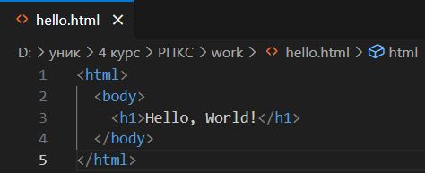
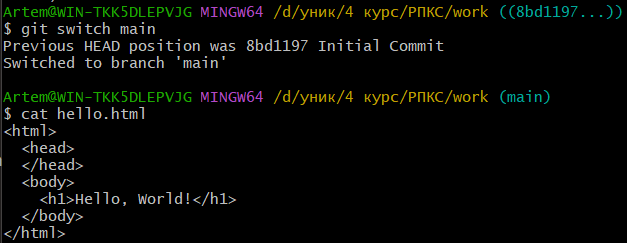
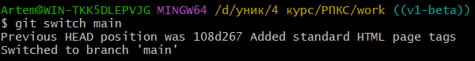
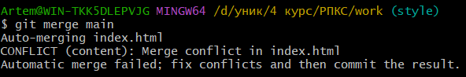
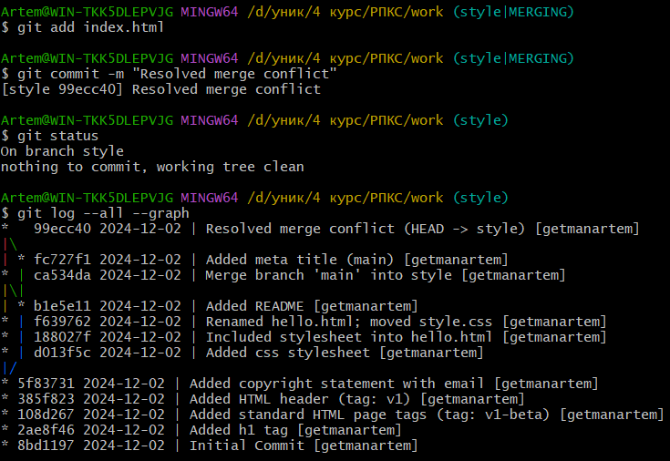
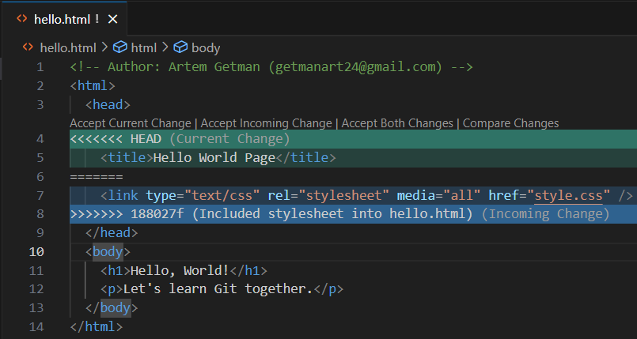
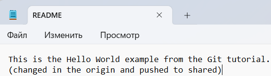

<h1>Лабораторна робота 1: Вивчення git</h1>

Налаштування глобальних параметрів Git для коректної обробки закінчень рядків. Команда `git config --global core.autocrlf true` забезпечує автоматичну конвертацію закінчень рядків, а `core.safecrlf warn` попереджає про можливі проблеми з конвертацією.

  

Створення робочого середовища проекту. Команда `mkdir work` створює нову директорію, а `cd work` виконує перехід до неї для подальшої роботи.

  

Створення першого файлу проекту hello.html з базовим текстом "Hello, World" за допомогою команди `touch`, що ініціалізує пустий файл в робочій директорії.

  

Налаштування ідентифікації користувача в Git. Команди встановлюють ім'я користувача (`git config --global user.name getmanartem`) та електронну пошту (`git config --global user.email getmanart24@gmail.com`) для майбутніх комітів.

  

Встановлення назви основної гілки проекту. Команда `git config --global init.defaultBranch main` визначає 'main' як назву гілки за замовчуванням для всіх нових репозиторіїв.

  

Перевірка статусу репозиторію за допомогою команди `git status`. На даний момент немає змін для коміту, робоче дерево чисте.

 

Додавання HTML-тегу h1 з текстом "Hello, World" до файлу hello.html для створення базової структури веб-сторінки.

 

Повторна перевірка статусу репозиторію. Git показує, що файл hello.html був змінений, але зміни ще не додані до індексу (not staged).

 

Ініціалізація нового Git репозиторію в поточній директорії за допомогою команди `git init`. Створюється прихована директорія .git для зберігання всієї службової інформації.

 

Додавання файлу hello.html до індексу за допомогою `git add` та створення першого коміту з повідомленням "Initial Commit" використовуючи команду `git commit -m`.

 

Створення коміту зі змінами в файлі hello.html. Було додано тег h1, що підтверджується статистикою: 1 файл змінено, 1 вставка, 1 видалення.

 

Перевірка статусу репозиторію після коміту. Git показує, що робоче дерево чисте - всі зміни збережені.

 

Оновлення структури HTML-документа. Додано базові теги `<html>` і `<body>` для створення валідної HTML-сторінки.

 

Додавання оновленого файлу hello.html до індексу. Git показує, що файл готовий до коміту.

 

Відображення вікна редактора для введення повідомлення коміту. Git показує які файли будуть включені до коміту та очікує на введення опису змін.

 

Створення коміту з доданням стандартних HTML тегів. Команда підтверджує зміни: 1 файл змінено, 5 вставок та 1 видалення. Після коміту Git показує наявність нових незафіксованих змін у файлі.

 

Використання команди `git add .` для додавання всіх змінених файлів до індексу. Статус показує, що зміни готові до коміту.

 

Додавання конкретного файлу hello.html до індексу за допомогою команди `git add hello.html`.

 

Додавання тегу `<head>` до структури HTML-документа, що робить його більш стандартизованим та готовим до подальших модифікацій.

 

Перевірка статусу репозиторію, яка показує, що файл hello.html має зміни як в індексі (staged), так і в робочій директорії (not staged).

 

Перегляд історії комітів у скороченому форматі за допомогою команди `git log --pretty=oneline`. Показує ID комітів та їх повідомлення в одному рядку.

 

Демонстрація різних параметрів команди `git log`:
- `--max-count=2` - обмеження кількості показаних комітів
- `--since="5 minutes ago"` - фільтрація за часом створення
- `--until="5 minutes ago"` - фільтрація до вказаного часу
- `--author="getmanartem"` - фільтрація за автором
- `--all` - показ всіх комітів

 

Використання розширеного формату виводу історії з часовими мітками та інформацією про автора за допомогою команди `git log --all --pretty-format:"%h %cd %s (%an)" --since="7 days ago"`.

 

Створення нового коміту з повідомленням "Added HTML header". Git підтверджує зміну 1 файлу з 2 вставками.

 

Детальний перегляд історії комітів з відображенням повної інформації: автор, дата, email та опис змін для кожного коміту.

 

Використання команди `git checkout v1^` для перегляду стану проекту на момент створення тегу v1. Система переходить в стан 'detached HEAD', що дозволяє експериментувати з кодом без впливу на основну гілку.

 

Налаштування формату виводу логу за допомогою команд:
- `git config --global format.pretty '%h %ad | %s%d [%an]'`
- `git config --global log.date short`
Це змінює формат виводу дат та інформації про коміти.

 

Перехід до початкового коміту за допомогою `git checkout 8bd1197`. Команда показує стан проекту на момент його створення, коли був лише простий текст "Hello, World".

 

Повернення до основної гілки за допомогою `git switch main`. Перегляд поточного стану файлу hello.html, який містить повну HTML структуру.

 

Створення тегу v1 та перегляд історії комітів, де тепер видно позначку тегу в логах. Це допомагає відзначити важливі етапи розробки.

 

Повернення до гілки main з режиму перегляду тегу v1-beta. Git підтверджує успішне переключення на основну гілку розробки.

 

Додавання коментаря "This is a bad comment. We want to revert it." до файлу hello.html. Цей коментар буде використано для демонстрації відміни змін.

 

Переміщення між тегами за допомогою команди `git checkout`. Спочатку перехід до тегу v1, потім до v1-beta, що демонструє різні стани проекту.

 

Перегляд доступних тегів у репозиторії за допомогою команди `git tag`. Показано два створені теги: v1 та v1-beta.

 

Використання команди `git log main --all` для перегляду повної історії комітів, включаючи інформацію про теги та гілки.

 

Використання `git checkout hello.html` для відміни небажаних змін у файлі. Після виконання команди Git підтверджує оновлення файлу та показує чисте робоче дерево.

 

Додавання коментаря "This is an unwanted but staged comment" до секції head файлу hello.html для демонстрації роботи з індексом.

 

Додавання змін до індексу за допомогою команди `git add hello.html` для подальшого комміту.

 

Перевірка статусу репозиторію після додавання змін. Git показує, що файл готовий до коміту (зміни в індексі).

 

Повторна перевірка статусу, яка показує наявність змін у файлі hello.html, які ще не додані до індексу (not staged).

 

Використання команди `git revert` для створення нового коміту, який скасовує зміни попереднього небажаного коміту, підтверджуючи зміну 1 файлу.

 

Виконання команди `git reset HEAD hello.html` для скидання змін з індексу, повертаючи файл до попереднього стану. Git підтверджує, що файл було "unstaged".

 

Використання `git checkout hello.html` для відновлення файлу з останнього коміту, після чого виконання `git status` показує чисте робоче дерево без змін.

 

Перегляд вмісту файлу hello.html у редакторі коду, який містить базову HTML структуру з заголовком "Hello, World!" та закоментованим рядком про небажану але закомічену зміну.

 

Додавання файлу hello.html до індексу та створення нового коміту з повідомленням "oops, we didn't want this commit", що підтверджує додавання одного файлу.

 

Виконання команди `git reset --hard v1` для жорсткого скидання HEAD до тегу v1, що відображає стан проекту на момент додавання HTML заголовку.

Перегляд історії комітів за допомогою `git log`, що показує хронологію змін від початкового коміту до додавання HTML заголовку.

Використання `git log --all` для перегляду повної історії комітів, включаючи revert-коміт та коміт з небажаними змінами. Після цього видалення тегу 'oops' командою `git tag -d oops`.

Повторний перегляд історії комітів, що підтверджує успішне видалення тегу 'oops' та збереження всіх інших комітів та тегів.

Створення нового тегу 'oops' та перевірка історії комітів для підтвердження успішного створення тегу.

Додавання інформації про автора в файл hello.html у вигляді коментаря, що містить ім'я та email.

Додавання змін до індексу за допомогою `git add hello.html` та створення коміту з повідомленням про додавання інформації про авторські права та email.

Перегляд історії комітів за допомогою `git log`, що показує новий коміт з доданою інформацією про авторські права.

Модифікація коментаря автора у файлі hello.html, видалення email адреси для спрощення.

Створення нового коміту зі зміненим коментарем автора та перегляд оновленої історії комітів за допомогою `git log`.

Додавання посилання на CSS файл до HTML документу за допомогою тегу link, що вказує на зовнішній файл стилів style.css.

Створення нової гілки 'style' за допомогою команди `git switch -c style` для роботи над стилізацією проекту.

Створення нового файлу style.css за допомогою команди `touch style.css` для додавання стилів.

Додавання CSS правила для зміни кольору заголовку h1 на червоний у файлі style.css.

Додавання файлу style.css до індексу та створення коміту з повідомленням про додавання таблиці стилів.

Перемикання на гілку 'main' та перегляд вмісту файлу hello.html, який не містить посилання на таблицю стилів.

Перемикання назад на гілку 'style' та перевірка вмісту файлу hello.html, який містить доданий тег link для підключення style.css.

Перегляд історії змін файлів hello.html та style.css за допомогою `git log [filename]`, що показує відповідні коміти для кожного файлу.

Додавання змін у файлі hello.html до індексу та створення коміту з повідомленням про включення таблиці стилів.

Перегляд повної історії комітів за допомогою `git log --all`, що показує всі зміни в обох гілках, включаючи додавання стилів.

Створення нової директорії 'css' та переміщення файлу style.css до неї за допомогою команди `git mv`. Також перегляд історії змін файлу за допомогою `git log --follow`.

Створення файлу README з базовим описом проекту, що пояснює його призначення як навчального прикладу з туторіалу GitHowTo.

Перемикання на гілку 'main', додавання файлу README до індексу та створення коміту з описовим повідомленням.

Використання команди `git show v1` для перегляду змін, які були внесені в коміті з тегом v1, що додав HTML заголовок.

Перейменування файлу hello.html на index.html за допомогою команди `mv` та оновлення індексу Git для відстеження змін.

Оновлення вмісту HTML файлу: додавання заголовку сторінки та параграфу з текстом про вивчення Git.

Використання команди `git log --all --graph` для візуалізації історії комітів у вигляді графу, що показує взаємозв'язки між гілками та комітами.

Перемикання на гілку 'style' за допомогою команди `git switch style` для подальшої роботи над стилізацією.

Автоматичне злиття (merge) гілки 'main' в гілку 'style' з використанням стратегії 'ort', що додає файл README.

Перемикання назад на гілку 'main' для продовження роботи над основною версією проекту.

Виникнення конфлікту при злитті гілок через одночасні зміни у файлі index.html. Git відображає різні версії файлу для порівняння.

Скасування процесу злиття за допомогою команди `git merge --abort` та перевірка статусу репозиторію.

Додавання файлу hello.html та створення нового коміту з повідомленням про додавання мета-заголовку.

Перегляд історії комітів у вигляді графу за допомогою `git log --all --graph`, що показує нову зміну та структуру гілок.

Спроба злиття гілки main в style, що призводить до конфлікту в файлі index.html через одночасні зміни в обох гілках.

Вирішення конфлікту злиття шляхом вибору потрібних змін, додавання файлу до індексу та створення коміту з повідомленням про вирішення конфлікту.

Використання команди `git reset --hard HEAD~2` для скидання HEAD на два коміти назад, до моменту перейменування файлу hello.html.

Перегляд історії комітів у вигляді графу після скидання HEAD, що показує поточний стан гілки.

Спроба злиття гілки main, що призводить до конфлікту в файлі index.html через різні зміни в обох гілках.

Остаточний вигляд файлу index.html після вирішення конфлікту злиття, що містить всі необхідні зміни з обох гілок.

Підготовка файлу hello.html до злиття, що включає заголовок сторінки та підключення таблиці стилів.

Використання команди `git add .` для додавання всіх змін до індексу.

Перегляд статусу та історії комітів після додавання змін, що показує оновлений стан репозиторію.

Спроба виконати rebase гілки main, що призводить до конфліктів у файлі hello.html через одночасні зміни.

Відображення конфліктних змін у файлі hello.html з можливістю вибору між поточними та вхідними змінами.

Перехід на рівень вище в директорії за допомогою команди `cd ..` та перегляд поточного шляху.

Клонування репозиторію work в нову директорію home за допомогою команди `git clone`.

Перехід до склонованого репозиторію та перегляд його вмісту, що містить README, директорію css та файл index.html.

Перемикання на гілку main та злиття змін з гілки style, що призводить до оновлення файлів та їх перейменування.

Перегляд повної історії комітів у вигляді графу після успішного злиття гілок, що показує всі зміни в проекті.

Перегляд усіх гілок репозиторію, включаючи віддалені, за допомогою команди `git branch -a`.

Перехід до оригінального репозиторію work за допомогою команди `cd ../work`.

Перегляд повної історії комітів за допомогою `git log --all`, що показує всі зміни включно з віддаленими гілками.

Перегляд налаштувань віддаленого репозиторію за допомогою команд `git remote` та `git remote show origin`.

Перевірка поточної гілки за допомогою команди `git branch`, що показує активну гілку main.

Перегляд вмісту файлу README за допомогою команди `cat`, що містить опис проекту.

Злиття змін з віддаленої гілки origin/main, що оновлює файл README.

Оновлений вміст файлу README з доданим текстом "(changed in origin)".

Додавання змін файлу README та створення коміту з повідомленням про зміни в оригінальному репозиторії.

Перехід до директорії home та отримання змін з віддаленого репозиторію за допомогою `git fetch`, після чого перегляд оновленої історії комітів.

Перехід до директорії work та додавання нового віддаленого репозиторію з назвою shared.

Перегляд оновленого вмісту файлу README з відміткою про зміни в origin.

Виконання команди `git pull` для отримання змін з віддаленого репозиторію, яка показує, що локальна версія вже актуальна.

Налаштування відстеження віддаленої гілки style та перегляд останніх двох комітів за допомогою `git log --max-count=2`.

Створення чистого клону репозиторію work за допомогою команди `git clone --bare` та перегляд його структури.

Запуск Git демона в режимі verbose для забезпечення мережевого доступу до репозиторію.

Клонування репозиторію з локального сервера за допомогою протоколу git:// в нову директорію network_work.

Перегляд оновленого вмісту файлу README з відміткою про зміни в origin та shared репозиторіях.

Додавання змін до файлу README, створення коміту та відправлення змін до віддаленого репозиторію shared.

Налаштування відстеження гілки shared/main та отримання змін з віддаленого репозиторію за допомогою git pull.

